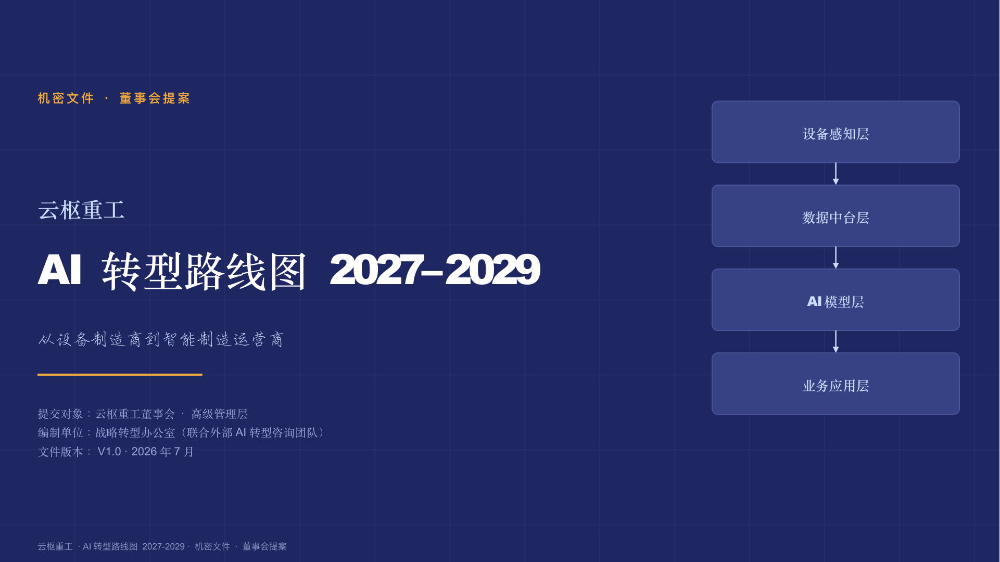

# PPT Engine

[](LICENSE)

中文 | [English](README_EN.md)

> **AI 不是帮你填模板，是帮你把 deck 想清楚。** PPT Engine 把"AI 一次成稿"拆成三段可控流程——**策略先想清楚 → 逐页硬门验收 → 原生可编辑导出**——专攻 waterfall / Mekko / Gantt 这类结构化图表、数字必须溯源、绝不栅格化的**咨询级 / 投资人级**高 stakes deck。

## 六个 demo，看效果

三个场景 × 中英双语，虚构品牌（不涉及真实客户），下载 `.pptx` 到 PowerPoint 里逐个元素点开改——这才是"原生可编辑"的意思。

<table>
<tr>
<td align="center" width="33%" valign="top">
<a href="examples/01_fmcg_growth_strategy/"></a>
<br/>
<sub><b>快消品增长战略</b> — 元气浆 2027 全国化增长战略 · 39 页<br/>
<a href="examples/01_fmcg_growth_strategy/元气浆_2027全国化增长战略.pptx">下载中文版</a> · <a href="examples/01_fmcg_growth_strategy/YuanQiJiang_2027_National_Growth_Strategy.pptx">Download EN</a></sub>
</td>
<td align="center" width="33%" valign="top">
<a href="examples/02_enterprise_ai_roadmap/"></a>
<br/>
<sub><b>制造业 AI 转型路线图</b> — 云枢重工 2027-2029 · 39 页<br/>
<a href="examples/02_enterprise_ai_roadmap/云枢重工_AI转型路线图2027-2029.pptx">下载中文版</a> · <a href="examples/02_enterprise_ai_roadmap/Yunshu_Heavy_Industries_AI_Transformation_Roadmap_2027-2029.pptx">Download EN</a></sub>
</td>
<td align="center" width="33%" valign="top">
<a href="examples/03_hospitality_brand_launch/"></a>
<br/>
<sub><b>文旅品牌启动战略</b> — 隐山 品牌启动与运营战略 · 38 页<br/>
<a href="examples/03_hospitality_brand_launch/隐山_品牌启动与运营战略.pptx">下载中文版</a> · <a href="examples/03_hospitality_brand_launch/YINSHAN_Brand_Launch_and_Operations_Strategy.pptx">Download EN</a></sub>
</td>
</tr>
</table>

## 你是不是也遇到过

- 找 AI 生成 PPT，出来是一张张栅格图，打开 PowerPoint 改不动一个字，也挪不动一个框；
- 让 AI 自己"编"数据，汇报时被问一句"这个数字哪来的"，答不上来；
- 瀑布图 / 甘特图 / 波士顿矩阵这类结构化图，AI 画出来的条形对不齐、占比加起来不是 100%，细看就穿帮；
- 一次性甩出 40 页，通篇是 AI 自己的叙事逻辑，不是你想讲的那个故事，改起来比重写还累。

PPT Engine 就是奔着这几件事去的——原生可编辑、数字必须有来源可查、结构化图表用代码算而不是让 AI"照猫画虎"、逐页跟你对齐而不是一次性甩全套。

## 核心亮点

- **原生可编辑，不是图片**：每个元素——文本框、形状、图表——在 PowerPoint 里都能单独点开改颜色改文字改位置，不是一张栅格图拍平了事。
- **结构化图表用代码算，不靠 AI 目测**：waterfall 的柱子必须数学连接、甘特图的条位必须对齐日期、占比必须求和 = 100%，几何和数据由确定性引擎计算，不是让模型现场画。
- **数字溯源硬门**：deck 上出现的每一个数字都要求能点回源头，查无来源直接拦下重做，不是"大概率没错"就放行。
- **一轮一轮跟你对齐，不批处理**：从解读 brief 到逐页定稿，全程跟你确认，不会一次性甩出一整份让你自己去挑错。
- **chaideck 自成长飞轮**：持续拆解真实成品 deck 入库进化方法论，用得越多，范本库 / 语感库越准，不是一套写死不变的模板。

## 工作流详解

PPT Engine 不是一个"brief 进、pptx 出"的黑盒，而是两条各自 fail-closed 的工作流接力，中间站着 chaideck 这个自成长飞轮。

### 策略工作流：五阶段，阶阶要过闸

```
模糊 brief
   │
   ▼
① 判目的 ──────── 定 delivery_purpose（演讲 / 阅读 / 预读讲解）+ 论证 mode + 美学倾向
   │   跟你逐项确认对齐，没对齐不往下走
   ▼
② 议题树 / 假设树（MECE）──── 把问题拆成互斥穷尽的子问题
   │   跟你确认树的形状对不对
   ▼
③ 调研 ──────── 数字溯源 + 来源分类（客户给的 / 联网查的 / 行业常识），逐议题播报进展
   │   跟你确认关键结论
   ▼
④ storyline ──────── 论点 + 一组证据 + framing + 节奏 + Part 章结构
   │   按 Part 写，写完一个 Part 就摊给你确认，不会闷头写完整份才给你看
   ▼
⑤ 三道审查质量门 ──────── 机检 + 人审，任一道不过打回原阶段返工，绝不带病推进
   │
   ▼
storyline 定稿 → 交棒制作工作流
```

### 制作工作流：定稿大纲 → 原生可编辑 pptx

```
storyline 定稿（大纲）
   │
   ▼
① 搭大纲 ──────── 拆到逐页结构
   ▼
② 设计定稿 ──────── 风格光谱选定 + spec_lock 完整设计契约（配色 / 字体 / 图标 / 图片全部锁定）
   │   跟你确认设计方向
   ▼
③ 逐页生产（一页一轮，绝不批量）
      模板映射 → 生成 SVG → 渲染预览 → 硬门质检
      质检不过 ──→ 打回本页重做，绝不带着问题进入下一页
   ▼
④ vendor 引擎导出 ──────── SVG → DrawingML，零栅格化验证
   ▼
交付：原生可编辑 .pptx
```

### chaideck：拆真实 deck 入库，方法论自己变强

```
真实成品 deck（投资人 deck / 咨询 deck 等）
   │
   ▼
拆解入六类资产库（页型卡 / 表达手法卡 / 分析框架卡 / 数据色板 / 真实样本 / 行业知识）
   │
   ▼
盲拆进化 ──────── 定期对已入库范例重新"零框架"拆解，比对新旧结论
   │
   ▼
方法论可信值台账升级 ──────── 卡库 / 语感库随使用积累，越用越准
```

## 内置资料库都有什么

开箱自带的是**方法论骨架**——已经建好结构、有起始内容，事实库 / 品牌库会随你使用逐步填充。

| 目录 | 内容 | 规模 |
|---|---|---|
| [`exemplars/页型卡库.json`](exemplars/页型卡库.json) | 页型手法卡：每张卡记录 `page_function`（页面功能）/ `technique`（手法）/ `mechanism`（为什么有效）/ `pick_when` / `skip_when` / `rating` | 101 张 |
| [`exemplars/表达手法卡.json`](exemplars/表达手法卡.json) | 文案表达手法卡：含六槽位结构性文案范式（章间桥 / 章小结 / 诊断收束 / ask 收尾 / 落幕 / 目录命名）+ 反模式（`anti_pattern`） | 142 张 |
| [`exemplars/分析框架库.json`](exemplars/分析框架库.json) | 分析框架卡：AIPL、波特五力、SWOT 等成熟框架的结构化编码（`structure` / `pick_when` / `skip_when` / `mechanism`） | 88 个 |
| [`exemplars/数据色板.json`](exemplars/数据色板.json) | 数据可视化配色方案（色系族） | 11 组 |
| [`specs/PPT方法论/`](specs/PPT方法论) | 9 篇方法论文档（00 总纲 / 01 顶级 deck 共因与翻车雷区 / 02 页型手法精华 / 03 场景叙事结构 / 04 范本清单按场景 / 05 质量门与评估 / 06 高 stakes 难图实现 / 07 演讲版 vs 阅读版 / 08 deck mode 叙事骨架体系），每篇标注可信度分级（方法论编码强候选 / 真样本背书），不装作和拆真实 deck 验证过的结论一样确定 | 9 篇 + 修订日志 |
| [`reinforce/deck_rules/`](reinforce/deck_rules) | 6 个机检模块：`rules.py`（数字必须带来源 / 标题论断式）、`client_tone.py`（拦"brief P3-4"这类内部工作语言泄漏到对客页面）、`storyline.py`（storyline 六条禁忌：主题式 / 缺 so-what / 含糊用语 / 太碎 / 没结尾 / 逻辑跳跃）、`svg_compat.py`（SVG→PPTX 导出兼容性黑名单）、`visual_review.py`（视觉缺陷结构化检查）、`font_embed.py`（字体嵌入授权检查） | 6 个规则模块 |
| [`research_lib/真实样本/`](research_lib/真实样本) | 真实成品 deck 拆解范例（如 Airbnb 2009 融资 deck 逐页拆解）+ 行业知识库骨架 | — |
| [`research_lib/开源拆解/`](research_lib/开源拆解) | ~30 个同类开源项目（AI PPT 生成器 / 图表库 / 文档解析等）的深度拆解笔记，方法论调研的原始依据 | ~30 篇 |

## 架构

**代码结构**：

- `engine/` —— 确定性引擎：图表几何（`chart_shapes.py`）、财务模型（DCF/LBO/可比公司，`financial_models.py`）、SVG→pptx vendor 导出引擎（`svg2pptx/`）、图像 / 图标 / 演讲稿生成管线。
- `reinforce/` —— 规则机检与状态：数字溯源 / 元叙述 / 对客调性等机检（`deck_rules/`）、设计契约锁（`spec_lock.py`）、deck 工作目录与状态、多角色策划团队、检索、chaideck 自成长飞轮（`evolution/`）。
- `skills/` —— 三条工作流对应的 SKILL.md，设计为在支持 Agent Skills 的编码助手（如 Claude Code）里加载使用。
- `specs/PPT方法论/` —— 沉淀下来的 PPT 方法论（见上表）。
- `exemplars/` `research_lib/` —— 卡库骨架与方法论调研知识（见上表）。

## 支持哪些 Agent 平台

`skills/` 下的 SKILL.md 遵循纯 Markdown + YAML frontmatter 的 Agent Skills 格式，本质只要求宿主 agent 能做三件事：**读写文件、执行命令、支持多轮对话**。满足这三条的编码 agent 原则上都能跑，包括但不限于 Claude Code、Codex CLI、Cursor、VS Code + Copilot、Windsurf。

### 最简单：直接把链接甩给它

不装插件、不用记命令，复制下面这句话丢给 Claude Code 或 Codex CLI 就行——它会自己 clone 仓库、自己读 SKILL.md、自己把 Python 环境装好：

> 帮我配置 https://github.com/biaojunqin-coder/Opustelic-ppt-engine 这个项目，把它的三个 skill 装进 Claude Code 里给我用。

Codex CLI 一样丢这句（把"Claude Code"换成"Codex"）：

> 帮我配置 https://github.com/biaojunqin-coder/Opustelic-ppt-engine 这个项目，把它的三个 skill 装进 Codex 里给我用。

这条路每次都是 agent 临场发挥装的，配置细节可能每次略有出入；想要固定、可复用、自动装好运行环境的方式，看下面的 Claude Code 插件安装法。

### Claude Code（原生支持 · 一条命令装好，更稳定）

本仓库自带 `.claude-plugin/marketplace.json`，两条命令装完，Python 运行环境（`engine`/`reinforce`）会在下次会话启动时被 `SessionStart` 钩子自动装进插件专属的虚拟环境，不用自己 `pip install`：

```
/plugin marketplace add biaojunqin-coder/Opustelic-ppt-engine
/plugin install ppt-engine@ppt-engine
```

装完输入 `/ppt-engine:策略工作流`（或直接用自然语言描述需求，触发条件写在每个 SKILL.md 的 `description` 里）即可加载对应工作流；三个 skill 都带插件名前缀（`ppt-engine:制作工作流`、`ppt-engine:chaideck`），不会和你本机其它同名 skill 冲突。

<details>
<summary>不想装插件、只想手动接入某个项目？</summary>

```bash
mkdir -p /path/to/your-project/.claude/skills
ln -s /path/to/PPT-oss/skills/策略工作流   /path/to/your-project/.claude/skills/策略工作流
ln -s /path/to/PPT-oss/skills/制作工作流   /path/to/your-project/.claude/skills/制作工作流
ln -s /path/to/PPT-oss/skills/chaideck    /path/to/your-project/.claude/skills/chaideck
```

这种方式需要自己 `pip install -e .` 装好 Python 环境，重启 Claude Code 后输入 `/策略工作流` 即可加载。
</details>

**Codex CLI**：2026 年起 Codex CLI 也有了自己一套插件市场机制（`.codex-plugin/plugin.json` + `.agents/plugins/marketplace.json`），原理和上面 Claude Code 这套几乎一样，但文件路径、钩子写法、环境变量名都不同。本仓库暂时没有专门为它发一份 manifest——没有 `codex` CLI 可以本地实测验证，怕写错 schema 导致装不上，所以先不装样子货。在它补上之前，直接用上面"甩链接"那招，或手动引用 SKILL.md 内容一样能跑。

**其他 agent（Cursor / VS Code + Copilot 等，手动引用）**：这些工具目前没有和 Claude Code 一致的 Skill 自动发现机制，但 SKILL.md 本质就是一份可读的指令文档，手动引用同样可用——直接在对话里说"读 `skills/策略工作流/SKILL.md`，按它的流程带我过一遍"，或者把内容整合进对应工具的自定义指令机制（如 Cursor 的 `.cursor/rules/`）。

## 快速开始

```bash
python3 -m venv .venv
.venv/bin/pip install -e .            # 装 engine + reinforce 两个能力包
.venv/bin/pip install -e ".[preview]" # 可选：渲染自检（另需 playwright install chromium）
.venv/bin/pip install -e ".[docling]" # 可选：PDF 版面分析增强
.venv/bin/python -m pytest            # 跑测试
```

技能（`skills/` 下的 SKILL.md）设计为在支持 Agent Skills 的编码助手里加载使用。

## 致谢：站在 ppt-master 肩上做的迭代

PPT Engine 的制作工作流不是从零造轮子，而是参考、迭代自 [ppt-master](https://github.com/hugohe3/ppt-master)（34k★）——它第一个把"AI 生成 SVG → 翻译成原生 DrawingML pptx"这条路验证到大规模可用，PPT Engine 制作层的 SVG→pptx 导出引擎就直接 vendor 自它（MIT，见 [engine/ppt_master/LICENSE.ppt-master](engine/ppt_master/LICENSE.ppt-master)）。在此向原作者 Hugo He 和 ppt-master 社区表示感谢。

ppt-master 本身定位是通用美学 deck 引擎（19 种视觉风格：杂志/数据新闻/瑞士网格/玻璃拟态/孟菲斯…），把"好看的 deck"这件事做得很完整。PPT Engine 站在这套引擎之上，往"咨询级/投资人级高 stakes deck"这个更窄但更深的方向做了几层进化：

1. **确定性图表几何引擎**：ppt-master 的 71 个图表模板已经备齐 waterfall/Gantt/Mekko 雏形等咨询级武器，我们在此基础上加了一层数据保真校验——bridge 必须数学闭合、占比必须求和 = 100%，图表不是 AI 目测画出来的，是代码算出来的。
2. **数字溯源硬门**：每页每个数字都要求能追溯到来源，无源硬拦——这是在 ppt-master "发散但不发明事实"的软规则之上，加了一道更严格的硬性质检。
3. **双层质检门**：在 ppt-master 已有的 SVG 语法层质检（禁用元素黑名单 / spec_lock 漂移检测）之外，加了一层内容层机检（元叙述 / 对客调性等），语法 + 内容两道 fail-closed。
4. **策略工作流的五阶段引导对齐**：把 ppt-master "八项确认"这套人机协商的 UX 骨架，延展成一整套面向咨询叙事的策略工作流——议题树 / 假设树（MECE）、storyline 论点证据结构、三道审查质量门。
5. **chaideck 自成长飞轮**：持续拆解真实成品 deck 入六类资产库 + 盲拆进化，让方法论随使用越积越准——这是 ppt-master 没有的、我们新长出来的能力。

## 依赖与许可

- 内置 vendor 的 SVG→pptx 导出引擎（来自 [ppt-master](https://github.com/hugohe3/ppt-master)，MIT）与 [simple-icons](https://simpleicons.org) 图标集（CC0），许可见各自目录。
- 本项目以 **Apache-2.0** 授权，见 [LICENSE](LICENSE) 与 [NOTICE](NOTICE)。
