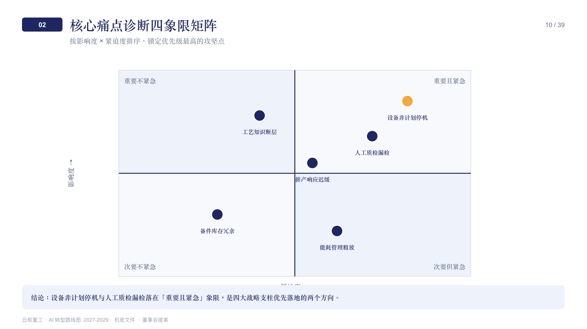
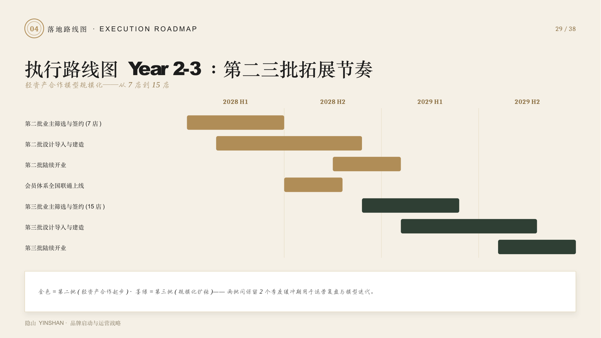

# PPT Engine

[](LICENSE)

English | [中文](README.md)

> **AI shouldn't just fill in a template — it should think the deck through.** PPT Engine splits "AI generates it in one shot" into three controllable stages — **strategy first, then a hard gate per slide, then a natively editable export** — built for consulting-grade / investor-grade decks with waterfall / Mekko / Gantt-style structured charts, numbers that must trace to a source, and zero tolerance for rasterized output.

## Sound familiar?

- You ask an AI to generate a deck, and get back a stack of rasterized images — you can't open PowerPoint and edit a single word or move a single box.
- You let the AI make up its own numbers, and get asked "where does this figure come from" in the room — and you can't answer.
- Structured charts like waterfalls, Gantt charts, or BCG matrices come out with bars that don't line up and shares that don't sum to 100% — it falls apart the moment anyone looks closely.
- The AI dumps 40 slides in one shot, all in its own narrative logic — not the story you actually wanted to tell — and fixing it takes longer than writing it yourself.

PPT Engine exists to fix exactly these problems: natively editable output, numbers that must have a traceable source, structured charts computed by code instead of AI eyeballing them, and a process that aligns with you slide by slide instead of dumping the whole thing at once.

## Core highlights

- **Natively editable, not a picture** — every element (text box, shape, chart) can be individually selected and edited in PowerPoint — color, text, position — not a flattened raster image.
- **Structured charts computed by code, not eyeballed by AI** — waterfall bars must connect mathematically, Gantt bars must align to real dates, shares must sum to 100%. Geometry and data come from a deterministic engine, not a model improvising on the fly.
- **A hard number-traceability gate** — every number that appears on a slide must trace back to a source; if it can't, it's blocked and reworked — not waved through because it's "probably fine."
- **Aligns with you round by round, never batches** — from reading the brief to finalizing each slide, it checks in with you the whole way, instead of dumping a finished deck for you to comb through for errors.
- **The chaideck self-growing flywheel** — continuously tears down real, finished decks to grow its methodology; the more it's used, the sharper the pattern library and phrasing library get — not a template frozen in time.

## Six demos, see for yourself

Three scenarios × bilingual (CN/EN), fictional brands (no real client data). Download the `.pptx` and open it in PowerPoint — click any element and edit it. That's what "natively editable" actually means.

<table>
<tr>
<td align="center" width="33%" valign="top">
<a href="examples/01_fmcg_growth_strategy/"></a>
<br/>
<sub><b>FMCG Growth Strategy</b> — YuanQiJiang 2027 National Growth Strategy · 39 slides<br/>
<a href="examples/01_fmcg_growth_strategy/YuanQiJiang_2027_National_Growth_Strategy.pptx">Download EN</a> · <a href="examples/01_fmcg_growth_strategy/元气浆_2027全国化增长战略.pptx">下载中文版</a></sub>
</td>
<td align="center" width="33%" valign="top">
<a href="examples/02_enterprise_ai_roadmap/"></a>
<br/>
<sub><b>Industrial AI Transformation Roadmap</b> — Yunshu Heavy Industries 2027-2029 · 39 slides<br/>
<a href="examples/02_enterprise_ai_roadmap/Yunshu_Heavy_Industries_AI_Transformation_Roadmap_2027-2029.pptx">Download EN</a> · <a href="examples/02_enterprise_ai_roadmap/云枢重工_AI转型路线图2027-2029.pptx">下载中文版</a></sub>
</td>
<td align="center" width="33%" valign="top">
<a href="examples/03_hospitality_brand_launch/"></a>
<br/>
<sub><b>Hospitality Brand Launch Strategy</b> — YINSHAN Brand Launch and Operations Strategy · 38 slides<br/>
<a href="examples/03_hospitality_brand_launch/YINSHAN_Brand_Launch_and_Operations_Strategy.pptx">Download EN</a> · <a href="examples/03_hospitality_brand_launch/隐山_品牌启动与运营战略.pptx">下载中文版</a></sub>
</td>
</tr>
</table>

Every deck leans on the structured charts generic tools can't do well — 2×2 matrices and Gantt charts among them:

<table>
<tr>
<td align="center" width="50%" valign="top">

<br/>
<sub>2×2 positioning matrix — Yunshu Heavy Industries pain-point diagnosis</sub>
</td>
<td align="center" width="50%" valign="top">

<br/>
<sub>Gantt chart — YINSHAN's 3-year store rollout cadence</sub>
</td>
</tr>
</table>

## Acknowledgment: iterating on top of ppt-master

PPT Engine's production workflow didn't reinvent the wheel — it's built by referencing and iterating on [ppt-master](https://github.com/hugohe3/ppt-master) (34k★), the project that first proved "AI generates SVG → translate it into native DrawingML `.pptx`" at real-world scale. PPT Engine's production-layer SVG→pptx export engine is vendored directly from it (MIT, see [engine/ppt_master/LICENSE.ppt-master](engine/ppt_master/LICENSE.ppt-master)). Thank you to Hugo He and the ppt-master community for that work.

ppt-master itself is positioned as a general-purpose aesthetic deck engine — 19 visual styles (magazine, data-journalism, Swiss grid, glassmorphism, Memphis…) — and it does "a deck that looks good" thoroughly well. PPT Engine builds on top of that engine and pushes further into a narrower, deeper direction: consulting-grade / investor-grade high-stakes decks. A few layers we added:

1. **Deterministic chart geometry engine** — ppt-master's 71 chart templates already cover consulting-grade weapons like waterfall/Gantt/Mekko-precursor charts; we added a data-fidelity layer on top — bridges must mathematically close, shares must sum to 100%. Charts aren't eyeballed by AI, they're computed by code.
2. **Hard number-traceability gate** — every number on every slide must trace back to a source, or it's hard-blocked. This sits on top of ppt-master's softer "diverge, don't invent facts" rule, adding a stricter, hard-enforced check.
3. **Two-layer quality gate** — on top of ppt-master's existing SVG syntax-level checks (forbidden-element blocklist / spec_lock drift detection), we added a content-level layer (meta-narration / client-facing tone) — syntax *and* content, both fail-closed.
4. **Five-stage guided alignment in the strategy workflow** — we extended ppt-master's "eight confirmations" human-in-the-loop UX skeleton into a full strategy workflow built for consulting narratives: issue tree / hypothesis tree (MECE), a storyline structure of claims + evidence, and three review quality gates.
5. **chaideck self-growing flywheel** — continuously tears down real, finished decks into six asset libraries + blind-teardown evolution, so the methodology gets sharper the more it's used. This is a capability ppt-master doesn't have — one we grew on our own.

## Architecture

**Two workflows + one flywheel**:

- **Strategy workflow** — turns a rough brief into a finalized storyline. Five fail-closed stages: define purpose (presented / read / pre-briefed-then-presented) → issue tree / hypothesis tree (MECE) → research (source-traced, sources classified) → storyline (claims + evidence + framing + pacing + Part structure) → three review quality gates.
- **Production workflow** — turns a finalized outline into a natively editable `.pptx`. Build outline → finalize design (style spectrum + spec_lock design contract) → per-slide (template mapping → generate SVG → render → hard gate, write-render-check one slide at a time) → vendor engine export (zero-rasterization verified) → deliver.
- **chaideck** — tears down real, finished decks into six asset libraries + blind-teardown evolution, so the pattern library / phrasing library gets more accurate the more it's used.

**Code layout**:

- `engine/` — deterministic engines: chart geometry (`chart_shapes.py`), financial models (DCF/LBO/comparables, `financial_models.py`), the vendored SVG→pptx export engine (`svg2pptx/`), and the image/icon/speaker-notes generation pipeline.
- `reinforce/` — rule-based checks and state: number traceability / meta-narration / client-facing tone checks (`deck_rules/`), the design-contract lock (`spec_lock.py`), deck workspace and state, the multi-role planning team, retrieval, and the chaideck self-growing flywheel (`evolution/`).
- `skills/` — the SKILL.md files for the three workflows above, designed to be loaded by coding assistants that support Agent Skills (e.g. Claude Code).
- `specs/PPT方法论/` — accumulated PPT methodology: what top decks have in common, page-level techniques, scenario narratives, quality-gate standards, presented vs. read versions, etc.
- `exemplars/` `research_lib/` — the card-library skeletons (page-type cards / expression-technique cards / analysis-framework cards) and methodology research — ready to use out of the box; the fact/brand libraries fill in as you use it.

## Skills

- **Strategy workflow**: brief → finalized storyline. Five guided stages: define purpose → issue tree / hypothesis tree → source-traced research → storyline (claims + evidence) → three quality gates.
- **Production workflow**: finalized outline → natively editable `.pptx`. Per-slide generate → render → hard gate, zero-rasterization export via the vendor engine.
- **chaideck**: tears down real, finished decks into six asset libraries + blind-teardown evolution — a self-growing methodology flywheel.

## Quick Start

```bash
python3 -m venv .venv
.venv/bin/pip install -e .            # install the engine + reinforce packages
.venv/bin/pip install -e ".[preview]" # optional: render self-check (also needs playwright install chromium)
.venv/bin/pip install -e ".[docling]" # optional: enhanced PDF layout analysis
.venv/bin/python -m pytest            # run tests
```

The skills (SKILL.md files under `skills/`) are designed to be loaded by coding assistants that support Agent Skills.

## Dependencies & License

- Bundles a vendored SVG→pptx export engine (from [ppt-master](https://github.com/hugohe3/ppt-master), MIT) and the [simple-icons](https://simpleicons.org) icon set (CC0) — see each directory for its own license.
- This project is licensed under **Apache-2.0** — see [LICENSE](LICENSE) and [NOTICE](NOTICE).
